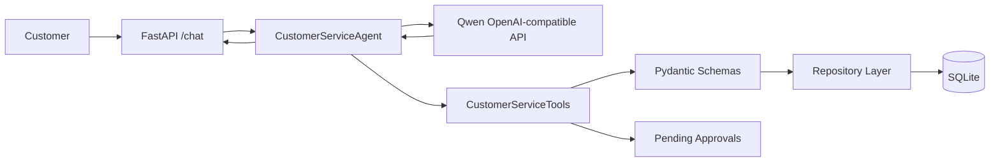

# Architecture

## Overview

The project is a FastAPI based customer service Agent. The Agent receives a user message, asks an OpenAI-compatible LLM to choose tools, validates the tool arguments with Pydantic, executes business functions against SQLite, and returns a structured response.

## Modules

- `config.py`: Reads `.env` and environment variables.
- `database.py`: Creates SQLite tables and seed data.
- `repositories.py`: Encapsulates SQLite reads and writes.
- `schemas.py`: Defines API models and tool argument validation.
- `tools.py`: Exposes business tools and JSON Schema definitions.
- `llm_client.py`: Wraps OpenAI-compatible chat completions with tools.
- `agent.py`: Orchestrates LLM calls, tool execution, and fallback answers.
- `api.py`: Provides FastAPI endpoints.
- `cli.py`: Provides local operations commands.

## Data Flow

1. Client sends a message to `/chat`.
2. The Agent sends the message plus tool schemas to the LLM.
3. The LLM returns one or more tool calls.
4. Each tool call is parsed and validated with Pydantic.
5. Tools read/write SQLite through the repository layer.
6. High-risk refunds are suspended in `pending_approvals`.
7. Tool results are sent back to the LLM for a final natural-language answer.

## Error Handling

- Missing API key returns a clear 503 response on `/chat`.
- Invalid tool parameters return `ok=false` with Pydantic error details.
- Order/customer mismatch returns a business error instead of leaking data.
- Large refunds return `requires_approval=true` and do not create a refund until approved.
